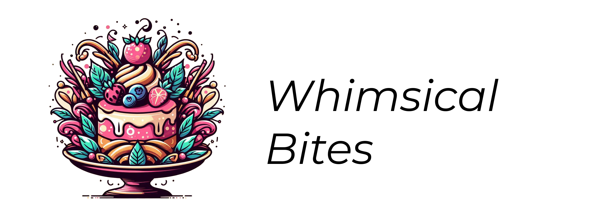

# Whimsical Bites

Whimsical Bites is a visually stunning bakery website developed using Flutter, offering a user-centric and immersive experience. This project excels in presenting a variety of bakery items through a well-structured and engaging layout. Notably, it leverages the BlocX package for superior scroll animation management, ensuring smooth and responsive navigation. By integrating advanced Flutter features and BlocX for dynamic content interaction, Whimsical Bites provides a seamless and aesthetically pleasing online culinary journey.

## Table of Contents

- [Installation](#installation)
- [Usage](#usage)
- [Features](#features)
- [Dependencies](#dependencies)
- [Configuration](#configuration)
- [Documentation](#documentation)
- [Troubleshooting](#troubleshooting)
- [Contributors](#contributors)
- [License](#license)

## Installation

To start using Whimsical Bites, follow these steps:

1. Clone the repository to your local machine.
2. Make sure Flutter is installed on your system.
3. Navigate to the project directory and run `flutter pub get` to install all dependencies.

## Usage

To run Whimsical Bites, use `flutter run` in your terminal. Ensure that you have either an emulator running or a physical device connected to run the website.

## Features

  

Whimsical Bites includes numerous features to enhance user interaction and provide detailed information:

- **Elegant and Interactive Design**: Utilizes Flutter's powerful UI capabilities for a visually appealing experience.
- **Advanced Scroll Tracking with BlocX**: Utilizing the BlocX package, the website expertly tracks user scrolling behavior. This feature is crucial in activating various animations at specific scroll positions, enhancing the dynamic feel of the site.
- **Dynamic Content Presentation**: Content is displayed in an organized manner, with sections like FirstSection, SecondSection, and so on, each elegantly revealing as the user scrolls.
- **Custom Animation**: Animations for text and images to make the user interface lively and engaging.
- **Responsive and Smooth Animations**: The website comes alive with smooth, responsive animations that make navigation a delightful experience. These animations are efficiently managed and triggered based on scroll position, thanks to BlocX's robust capabilities.

## Dependencies

Whimsical Bites is built using the following Flutter dependencies:

- `cupertino_icons`: For iOS-style icons.
- `google_fonts`: For custom fonts.
- `flutter_bloc`: For state management.
- Other internal Flutter dependencies.

## Configuration

No additional configuration is required beyond the standard Flutter setup.

## Documentation

This project is documented through inline comments within the codebase for clarity and ease of understanding.

## Troubleshooting

For any Flutter-related issues, refer to the official Flutter documentation. Common issues may include dependency conflicts or widget rendering issues.

## Contributors

Whimsical Bites is customized by me and based on a tutorial by @AmIWorthy (Youtube channel), the asset files for the website were downloaded from unsplash.com. Contributions in the form of feedback, bug reports, or code are always welcome.

## License

This project is open-sourced under the [MIT License](https://opensource.org/licenses/MIT).
